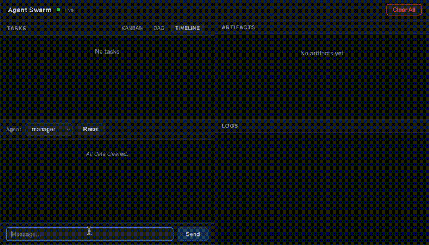
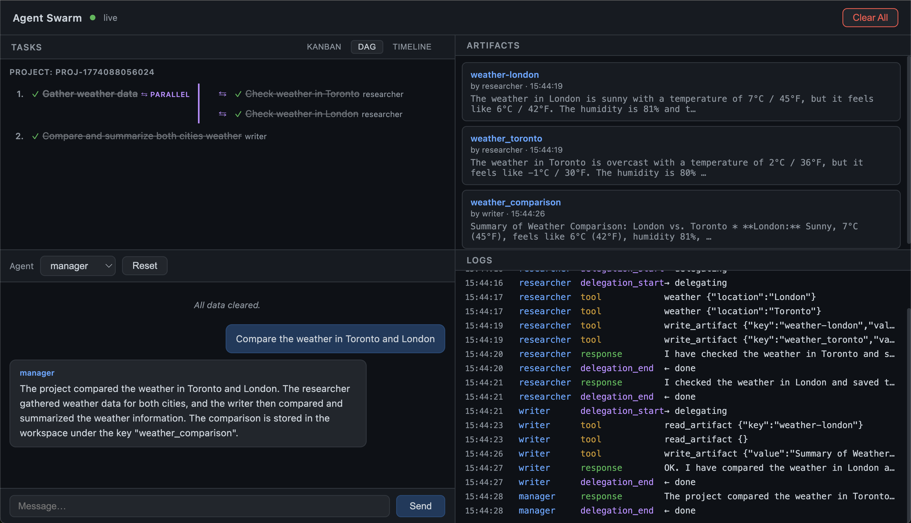
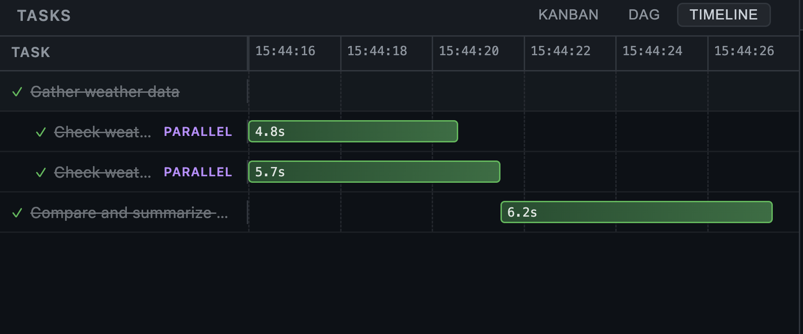

# Zero to Agent Swarm, Part 2: A Party of Agents


This is the second part of the Zero-to-Agent-Swarm tutorial.
In the first part, we went from zero to a working AI agent. If you want to check that out, it’s here:

**[← Part 1: Birth and Upgrades](./tutorial.md)** — building a single agent from scratch.

---

This part is about going from one agent to an agent swarm — making agents work *together* for us.

We’ll need a new mental model. In Part 1, the model was about what an agent *is* — Triggers + loop(LLM + Tools + Memory). Now we need to think about what agents *do* when there are many of them. We need to consider them — I hate to say this — more like humans. Not because AI is sentient, no, not by a large measure. But because we’ve built computers to resemble human functions, and we have centuries of experience making human systems productive. We can steal a lot of that for agent systems.

Here’s the progression:
1. **Specialization** — same code, different agents
2. **Delegation** — agents calling agents
3. **Workspace** — shared state for coordination
4. **Project execution** — structured plans with parallel execution


---

## 1. Specialization — Same code, different agent

*Adding to the model: the **Genome** that defines each agent.*

One agent is useful. But real work often needs specialists — a researcher, a coder, a reviewer — each with their own tools, memory, and responsibilities. A single agent can context-switch between roles, but it loses focus. Dedicated agents stay sharp — and they can work in parallel.

What makes one agent different from another?
- Its **Thinking** (which model, what system prompt)
- Its **Memory** (what it knows)
- Its **Tools** (what it can do)
- Its **Triggers** (what wakes it up)
- Its **Container** (what it can see)

Package these together into a config — the agent’s **genome** — and from one codebase you can spin up as many specialized agents as you need.

[Explanation](./phase-3-step-1.md) · [Code](https://github.com/ordervschaos/zero-to-agent-swarm/tree/phase-3-step-1) · [Skill](../.claude/skills/phase-3-step-1-agent-replication.skill)

But spinning up specialists isn’t enough — right now they’re isolated. Each one works alone. How do we get them to collaborate?

---

## 2. Delegation — Agents calling agents

*Adding to the model: **ask_agent**, the simplest possible multi-agent pattern.*

The first step towards a team is asking for help when needed. If the **coder** needs documentation, why write it itself when there’s a **writer** agent that can do it better and cheaper?

The simplest way: let an agent call another agent as a tool.

```
User → Researcher: "Get the weather in Toronto and have someone write a summary"
         ├── weather: checks Toronto weather
         ├── ask_agent("writer", "summarize the weather in Toronto")
         │     └── Writer runs → returns summary
         └── delivers: "Toronto weather summary"
```

The implementation is straightforward: we add a new tool `ask_agent`. One agent’s loop runs inside another agent’s loop — the same pattern from Part 1, just nested.

[Explanation](./phase-3-step-2.md) · [Code](https://github.com/ordervschaos/zero-to-agent-swarm/tree/phase-3-step-2-new) · [Skill](../.claude/skills/phase-3-step-2-delegation.skill)

This works, but it has a bottleneck: all information flows through the delegator. The researcher becomes a middleman, passing data between agents it doesn’t need to understand. What if agents could share data directly?


---

## 3. Workspace — Shared state for coordination

*Adding to the model: a **Global Workspace** where agents coordinate through shared tasks and artifacts.*

A **global workspace** solves the middleman problem. It’s a shared directory on disk with two coordination primitives: **Tasks** — a shared to-do list where the manager posts work and specialists claim it, and **Artifacts** — a key-value store where agents drop research findings, drafts, or anything another agent might need. We also appoint a **manager** agent — the bridge between the user and the specialists.

### The manager loop

A **manager agent** drives the whole thing. Its identity is simple: break the goal into tasks, delegate each to a specialist, check progress, repeat until done. The manager never does the work itself — it orchestrates.


Without the workspace, the manager has to micromanage — relaying data between agents like a middleman. With the workspace, agents self-serve: the manager says "check the workspace for open tasks" and each specialist claims work, reads artifacts for context, does the job, and marks it done. The manager doesn't relay data — it just points agents at the workspace and checks progress.

This is the difference between a manager who dictates every detail and one who says "the work's on the board — go."

[Explanation](./phase-3-step-3.md) · [Code](https://github.com/ordervschaos/zero-to-agent-swarm/tree/phase-3-step-3) · [Skill](../.claude/skills/phase-3-step-3-global-workspace.skill)

---

> **Checkpoint:** We now have a manager agent that breaks work into tasks, delegates to specialists who coordinate through a shared workspace, and loops until everything is done. That's a working swarm. But everything still runs one task at a time — even when tasks are independent.

## 3.5 Intermission — A web UI

Before we tackle that, let's make the swarm easier to watch. Reading JSON files and terminal output gets old. A web dashboard gives you a live window into everything at once — tasks on a kanban board, agents chatting, artifacts appearing, log events streaming in.


[Explanation](./phase-3-step-3-5.md) · [Code](https://github.com/ordervschaos/zero-to-agent-swarm/tree/phase-3-step-3-5) · [Skill](../.claude/skills/phase-3-step-3-5-web-ui.skill)

---

## 4. Project execution — From flat task lists to DAGs

*Adding to the model: a **Task Tree** that captures dependencies, enabling parallel + serial execution.*

The workspace gives us coordination, but the execution is flat. The manager posts tasks one-by-one, checks progress in a loop, and everything runs serially — even when tasks have nothing to do with each other. Real projects have structure: some things must happen in order, others can happen at the same time.





A **DAG** (Directed Acyclic Graph) captures what actually matters: *which tasks depend on which*. Everything else can run simultaneously. The manager thinks in **task trees** — nested groups marked as sequential or parallel — and the runtime flattens them into a dependency graph, executing waves of unblocked tasks with `Promise.all`. Dependent tasks automatically inherit the results of their prerequisites, so agents never duplicate work.

The difference: a flat plan says "check Toronto, then London, then compare" (serial — slow). A DAG says "check both cities at the same time, then compare" (parallel where possible — fast). The DAG finds the fastest path through the work.

[Explanation](./phase-3-step-4.md) · [Code](https://github.com/ordervschaos/zero-to-agent-swarm/tree/phase-3-step-4) · [Skill](../.claude/skills/phase-3-step-4-dag-execution.skill)

---

> **Hurray!** We now have a manager agent that decomposes goals into structured task trees, executes them as DAGs with maximum parallelism, passes context between dependent tasks, and visualizes the whole thing in a live web dashboard.

There are many more concepts to explore — reliability, error recovery, human-in-the-loop, cost control, evaluation — and I'm planning to publish them as smaller, standalone pieces alongside this series.

---
**Thanks for reading! [Follow me](https://medium.com/@anzal.ansari) for more first-principles breakdowns of modern AI systems.**
