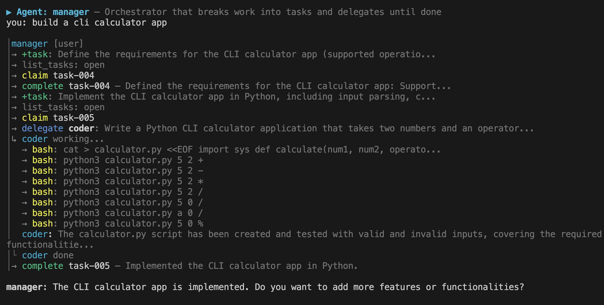
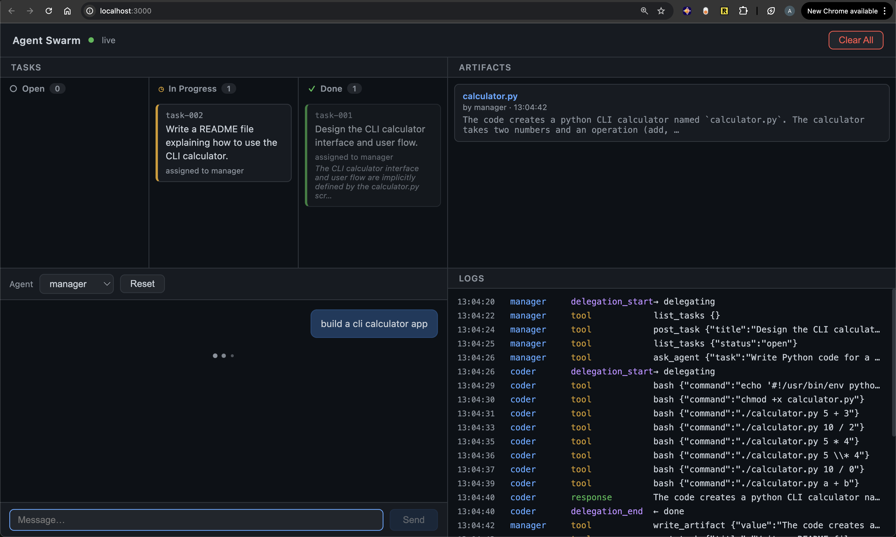

# Zero to Agent Swarm, Part 2: A Party of Agents

**[← Part 1: Birth and Upgrades](./tutorial.md)** — building a single agent from scratch.

---

Here's where the mental model shifts. So far we've been thinking about what an agent *is* — triggers, loop, tools, memory. Now we start thinking about what an agent *does* — the role it plays.

A coder. A writer. A researcher. These map naturally onto how we already think about work. Once you frame agents as roles, a lot of things click into place: why they need different tools, different memory, different authority. And why some of them need to talk to each other.

---

## 1. Spin up multiple agents — Same code, different agent

*Adding to the model: the **Genome** that defines each agent.*

One agent is useful. But real work often needs specialists — a researcher, a coder, a reviewer — each with their own **Tools**, **Memory**, and responsibilities. A single agent can context-switch between roles, but it loses focus. Dedicated agents stay sharp — and they can work in parallel.


What makes one agent different from another? Its **Thinking** (which model, what system prompt), its **Memory** (what it knows), its **Tools** (what it can do), its **Triggers** (what wakes it up), and its **Container** (what it can see). Package these together into a config — the agent's genome — and from one codebase you can spin up as many specialized agents as you need.

The agent is no longer a singleton. A JSON config file — the genome — declares an agent's identity, tools, triggers, and description. The `Agent` class reads this config and becomes whatever the genome says. Memory is per-agent (`memory/<name>/`), tools are filtered from a registry, and triggers are opt-in.

To create a new agent, add a JSON file to `agents/`. To start it: `AGENT_NAME=researcher npm start`. No code changes needed.

```
agents/
├── default.json       ← general-purpose assistant
└── researcher.json    ← research specialist
```

[Explanation](./phase-3-step-1.md) · [Code](https://github.com/ordervschaos/zero-to-agent-swarm/tree/phase-3-step-1) · [Skill](../.claude/skills/phase-3-step-1-agent-replication.skill)

---

## 2. Agent to agent delegation — The simplest possible multi-agent pattern

Agents can be different, but they still work alone. If the coder needs documentation, it has to write it itself. What if another agent can do it better and cheaper? Delegation is the natural next step.


The simplest way to achieve this is by allowing an agent to call another agent as a tool.


```
User → Coder
         ├── bash: writes calculator.py
         ├── ask_agent("writer", "write docs for calculator.py")
         │     └── Writer runs → returns docs
         └── delivers: "Built calculator + docs"
```

Here's what's actually happening under the hood — two agentic loops, one nested inside the other:

```
┌─────────────────────────────────────────────────────────┐
│  Coder's Loop                                           │
│                                                         │
│  User: "Build a calculator, then get someone to         │
│         write the docs"                                 │
│                                                         │
│  ┌─ Iteration 1 ──────────────────────────────────────┐ │
│  │  Think → "I need to write code first"              │ │
│  │  Tool  → bash: writes calculator.py                │ │
│  └────────────────────────────────────────────────────┘ │
│                                                         │
│  ┌─ Iteration 2 ──────────────────────────────────────┐ │
│  │  Think → "Code done. User wants docs — delegate."  │ │
│  │  Tool  → ask_agent("writer", "write docs for       │ │
│  │           calculator.py")                           │ │
│  │                                                    │ │
│  │  ┌─ Writer's Loop (runs inside this tool call) ──┐ │ │
│  │  │  Think → "I need to read the file first"      │ │ │
│  │  │  Tool  → bash: cat calculator.py              │ │ │
│  │  │  Think → "Now I can write documentation"      │ │ │
│  │  │  Tool  → bash: writes calculator_docs.md      │ │ │
│  │  │  Think → "Done." → return result              │ │ │
│  │  └───────────────────────────────────────────────┘ │ │
│  │                                                    │ │
│  │  ← Writer returns: "Created calculator_docs.md"    │ │
│  └────────────────────────────────────────────────────┘ │
│                                                         │
│  ┌─ Iteration 3 ──────────────────────────────────────┐ │
│  │  Think → "Code + docs done. Deliver result."       │ │
│  │  Tool  → respond_to_user("Built calculator + docs")│ │
│  └────────────────────────────────────────────────────┘ │
└─────────────────────────────────────────────────────────┘
```

The key insight: `ask_agent` is just a tool. The coder's loop pauses on iteration 2, the writer's loop runs to completion, and then the coder's loop resumes with the result. Loops inside loops — the same pattern from Phase 1, just nested.

[Explanation](./phase-3-step-2.md) · [Code](https://github.com/ordervschaos/zero-to-agent-swarm/tree/phase-3-step-2-new) · [Skill](../.claude/skills/phase-3-step-2-delegation.skill)

---

## 3. Global Workspace — Shared state for agent coordination

*Adding to the model: a **Global Workspace** where agents coordinate through shared tasks and artifacts.*

Delegation is powerful, but it has a bottleneck: all information flows through the delegator. When the coder asks the researcher to analyze a codebase, the researcher's findings come back as a return value — and the coder has to relay them to the writer. The coder becomes a middleman, passing data it doesn't need to understand.

A **global workspace** solves this. It's a shared directory on disk with two coordination primitives:

- **Tasks** — a shared to-do list. The manager posts tasks, delegates to specialists who claim them, check progress, and keeps going until everything is done.
- **Artifacts** — a key-value store for data. Research findings, drafts, analysis — anything one agent produces that another might need.

### The manager loop

A **manager agent** drives the whole thing. Its identity is simple: break the goal into tasks, delegate each to a specialist, check progress, repeat until done. The manager never does the work itself — it orchestrates.



The manager's loop has a higher iteration cap (`maxIterations: 25` in the genome) because it needs room to post tasks, delegate multiple times, and check progress between each delegation.

The workspace lives on disk:

```
workspace/
├── tasks.json       ← shared task list
└── artifacts.json   ← shared data store
```

Tasks have a simple lifecycle — `open` → `in_progress` → `done`:

```json
{
  "id": "task-001",
  "title": "implement calculator",
  "status": "done",
  "assignee": "coder",
  "postedBy": "manager",
  "result": "Created calculator.py with add, subtract, multiply, divide"
}
```

Five tools make it work:

| Tool | What it does |
|------|-------------|
| `post_task` | Add a task to the workspace |
| `list_tasks` | See tasks (filter by status) |
| `update_task` | Claim an open task or complete one |
| `write_artifact` | Store data under a key for other agents |
| `read_artifact` | Read data another agent left |

### Why this matters

Without the workspace, the manager has to micromanage everything:

```
ask_agent("writer", "Write docs for calculator.py. Here's the test output: [paste]. Here's the API: [paste].")
```

With the workspace, agents self-serve:

```
ask_agent("writer", "Check the workspace for open tasks and pick up what you can.")
```

The writer checks `list_tasks`, claims a task, reads artifacts for context, does the work, and marks it done. The manager doesn't relay data — it just points agents at the workspace and checks progress.

This is the difference between a manager who dictates every detail and one who says "the work's on the board — go."

[Explanation](./phase-3-step-3.md) · [Code](https://github.com/ordervschaos/zero-to-agent-swarm/tree/phase-3-step-3) · [Skill](../.claude/skills/phase-3-step-3-global-workspace.skill)

---

> **Checkpoint:** We now have a manager agent that breaks work into tasks, delegates to specialists who coordinate through a shared workspace, and loops until everything is done. That's a working swarm.

## 3.5 A fun intermission - Let's build a web UI

The swarm is working. But watching it means reading JSON files and terminal output. A web dashboard gives you a live window into everything at once — tasks moving through a kanban, agents chatting, artifacts appearing, log events streaming in.



The key idea is an **event bus** (`log-events.ts`): a Node.js `EventEmitter` that agents write to as they work. The UI server holds a set of open browser connections and forwards every event to every tab via **Server-Sent Events** (SSE). The browser never polls — it just listens.

```
Agent loop
  │  emits on logBus
  ▼
ui-server.ts
  │  broadcasts via SSE
  ▼
browser (EventSource) → Kanban · Artifacts · Chat · Logs
```

Two new files do all the work:

- **`src/ui-server.ts`** — a plain Node.js HTTP server. Serves `ui/index.html`, exposes a REST API (`/api/agents`, `/api/tasks`, `/api/artifacts`, `/api/chat`, `/api/clear`), and streams live events via SSE at `/api/events`. Keeps one `Agent` instance per agent name so chat history persists across messages.
- **`ui/index.html`** — a single HTML file (no bundler, no framework). A 2×2 CSS grid: Tasks kanban top-left, Artifacts top-right, Chat bottom-left, Logs bottom-right. All panels update live from the SSE stream.

```bash
npm run ui   # http://localhost:3000
```

[Explanation](./phase-3-step-3-5.md) · [Code](https://github.com/ordervschaos/zero-to-agent-swarm/tree/phase-3-step-3-5) · [Skill](../.claude/skills/phase-3-step-3-5-web-ui.skill)

---

## 4. DAG Execution — From flat task lists to structured project plans

*Adding to the model: a **Task Tree** that captures dependencies, enabling parallel + serial execution.*

The global workspace is a foundation — but it's flat. The manager posts tasks one-by-one, checks progress in a loop, and everything runs serially even when tasks have nothing to do with each other. Real projects have structure: some things must happen in order, others can happen at the same time.

A **DAG** (Directed Acyclic Graph) captures what actually matters: *which tasks depend on which*. Everything else can run simultaneously.

```
research ──┐
           ├──▶ implement ──┬──▶ test
scaffold ──┘                └──▶ docs
```

`research` and `scaffold` share no dependency — they run in parallel. `implement` needs both — it waits. `test` and `docs` both need `implement` — they run in parallel after it.

### The tree model

Rather than making the LLM specify flat `dependsOn` arrays (error-prone), the manager thinks in **task trees** — a structure that maps naturally to how we decompose work:

```json
{
  "goal": "Build a REST API with docs",
  "sequential": true,
  "tasks": [
    { "id": "research", "title": "Gather requirements", "agent": "researcher" },
    { "id": "implement", "title": "Implementation", "agent": "coder",
      "sequential": false, "subtasks": [
        { "id": "scaffold", "title": "Create project structure", "agent": "coder" },
        { "id": "endpoints", "title": "Implement API endpoints", "agent": "coder" }
      ]},
    { "id": "validate", "title": "Validation", "agent": "researcher",
      "sequential": false, "subtasks": [
        { "id": "test", "title": "Write and run tests", "agent": "researcher" },
        { "id": "docs", "title": "Write API documentation", "agent": "writer" }
      ]}
  ]
}
```

Two rules control the tree:
- **`sequential: true`** — siblings run one after another, each blocked by the previous
- **`sequential: false`** (or omitted) — siblings run in parallel

Container tasks (those with `subtasks`) auto-complete when all their children finish. Only leaf tasks get delegated to specialist agents.

The runtime flattens this tree into a DAG with computed `dependsOn` arrays, then executes it in waves:

```typescript
while (remaining nodes exist) {
  ready = nodes whose every dep is already in results
  if (ready is empty) → deadlock, throw
  results += await Promise.all(ready.map(executor))
}
```

Each wave finds everything that's unblocked, runs it in parallel with `Promise.all`, then checks again. A node runs as early as it possibly can.

### Context passing

When a dependent task runs, it automatically receives the results from its prerequisites:

```
Context from completed prerequisites:
[Gather requirements]:
  <researcher's output>

[Create project structure]:
  <coder's output>
```

Specialist agents don't need to re-discover anything — they inherit exactly what upstream tasks produced.

### The `run_project` tool

The manager calls this once with a goal and a task tree. Under the hood it:
1. Flattens the tree into a DAG with computed dependencies
2. Posts all tasks to the workspace (visible in the web UI immediately)
3. Executes the DAG wave by wave
4. For each leaf: claims the task, delegates to the specialist, completes it
5. Returns a full summary when the entire graph is done

### DAG visualization in the web UI

The dashboard gained a new view — toggle between Kanban and DAG to see the task tree rendered as a nested list with sequential (numbered) and parallel (bulleted) groupings. Tasks light up as they progress: grey (open), yellow (in progress), green with strikethrough (done).

### Why trees over flat lists

The manager's decision rule is simple: *"Does task B need the output of task A?"* If no, they're parallel. If yes, they're sequential. Nesting captures this naturally — no need to manually wire dependency IDs.

This is the difference between a project plan that says "do these 7 things in order" and one that says "do these 3 things, then these 2 things in parallel, then wrap up." The DAG finds the fastest path through the work.

[Explanation](./phase-4-step-1.md) · [Code](https://github.com/ordervschaos/zero-to-agent-swarm/tree/phase-4-step-1) · [Skill](../.claude/skills/phase-4-step-1-dag-execution.skill)

---

> **Checkpoint:** We now have a manager agent that decomposes goals into structured task trees, executes them as DAGs with maximum parallelism, passes context between dependent tasks, and visualizes the whole thing in a live web dashboard. That's a production-grade orchestration pattern.

## What's next

With DAG execution in place, the swarm can tackle projects with real structure — not just a flat list of chores, but a plan where each piece builds on the last. Next up: **reactive tasks** — tasks that spawn new sub-DAGs based on what they discover at runtime.

---
**Thanks for reading! [Follow me](https://medium.com/@anzal.ansari) for the next part and more first-principles breakdowns of modern AI systems.**
