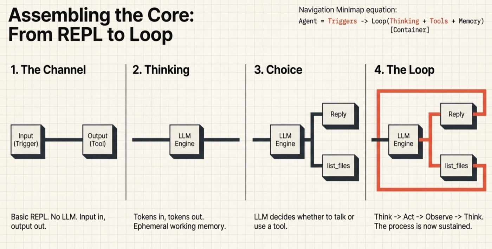
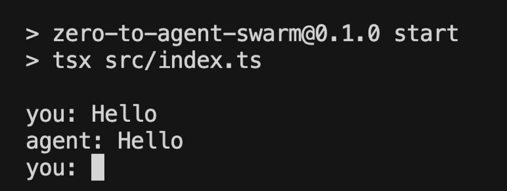
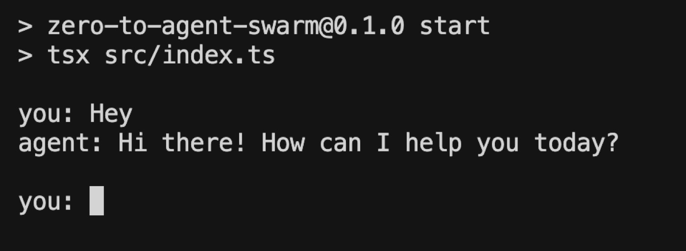
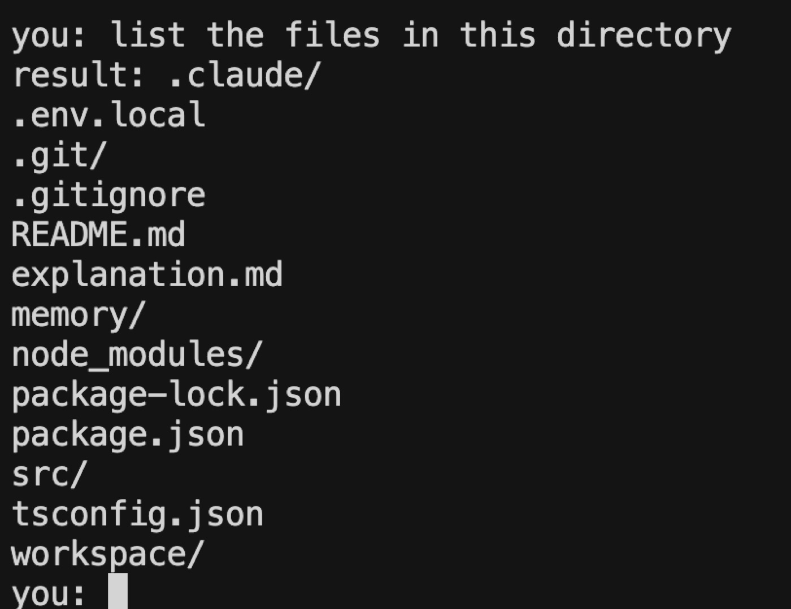
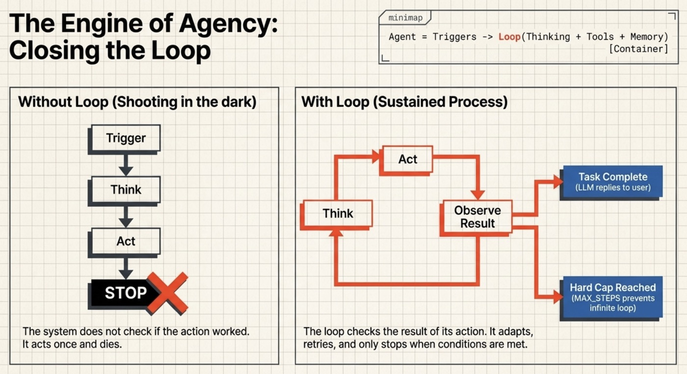
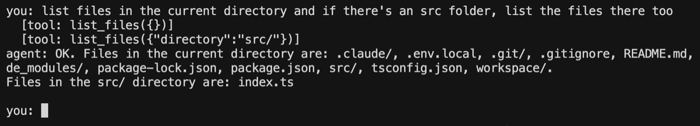
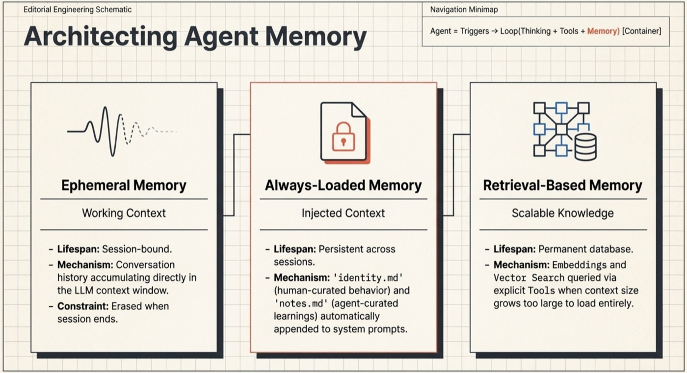
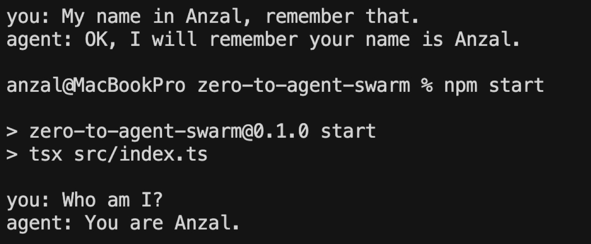
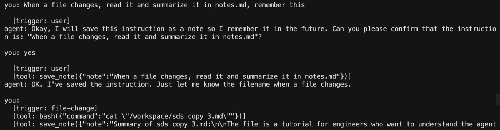

# Zero to Agent Swarm: A hands-on guide to building AI agents from scratch


## Is this for you?

This tutorial is for engineers who already know how to build software but want to understand the **agent ecosystem**. The code is in **TypeScript** / **Node.js** — familiarity helps but isn't required. We'll use **Docker** in Phase 2, and you'll need an **LLM API key** (the default is Gemini, but any provider works — just swap the LLM call).

The goal isn't to walk you through a codebase. It's to give you the thinking tools to design agent architectures, features, and systems — so that by the end, you understand how a single agent works and how multiple agents coordinate.

## The mental model

Here is the model we'll build toward, one piece at a time:

> **Agent = Triggers → Loop(Thinking + Tools + Memory), inside a Container**

**Triggers** are what start the loop. A user message is the obvious one, but triggers can also be a schedule, a webhook, a file appearing in a directory, or another agent handing off a task.

**Thinking** is where the LLM lives. On each iteration, the agent looks at its goal, what it knows so far, and what just happened — then decides what to do next. This includes **perceiving** the input (understanding what arrived before reasoning about it) and **assembling context** — the system prompt, identity, memory, conversation history, and latest observation that get sent to the LLM.

**Tools** are how the agent acts on the world. In this model, the agent has no default output channel — it can't print, respond, or signal completion without a tool. Text generation is just internal reasoning until a tool carries it somewhere. That's a deliberate design choice: it forces you to think explicitly about every action the agent can take, because nothing happens implicitly. The set of tools you give an agent is its interface with the world.

**Memory** is what persists across iterations. Without it, each thinking step starts from scratch. With it, the agent can accumulate facts, track progress, and avoid repeating itself. Memory can live in the context window, in a file, or in a database — depending on how long it needs to last.

**The container** is the environment the agent runs in. It's easy to overlook, but it matters: it defines what tools are available, what the agent can access, and — critically — what it can't damage. A well-designed container is what makes autonomy safe enough to actually grant.


**A note on loops:** The formula shows one loop — but real applications are rarely that flat. In practice, loops nest. A single agent might run an inner loop to complete a subtask, while sitting inside a larger loop that coordinates multiple agents, manages retries, or waits for external triggers. An agent swarm is really just loops containing loops, with handoffs between them. 

## The roadmap

We build in three phases:

| Phase | Goal | What you'll have |
|-------|------|-----------------|
| **1. Birth** | Build a single agent from scratch | A local assistant that can explore your filesystem |
| **2. Upgrades** | Make it powerful and safe | Memory, a Docker container, bash, autonomy |
| **3. Swarm** *(coming soon)* | Run multiple agents together | Specialized agents coordinating on tasks |

Let's build one.

---

# Phase 1: Birth of an Agent

We start even simpler than an LLM call — a plain input/output loop with no intelligence at all — and build up step by step until we have something that genuinely qualifies as an agent.



---

## 1. Make it talk. A Channel = 1 Trigger + 1 Tool

*Adding to the model: the first **Trigger**, the first **Tool**, and therefore the first **Channel**.*

A message arriving is a **Trigger**. A reply going out is a **Tool** — not in the API "tool use" sense, but in the first-principles sense: it's a capability the agent uses to act on the world. Together, a Trigger and a Tool form a **Channel**: something that listens and something that speaks back.

We start with the simplest possible version: a REPL. You type something, it prints it back. No LLM, no logic. Just the Channel: input in, output out.



This is the scaffold everything else will hang on.

[Explanation](./phase-1-step-1.md) · [Code](https://github.com/ordervschaos/zero-to-agent-swarm/tree/phase-1-step-1) · [Skill](../.claude/skills/phase-1-step-1-make-it-talk.skill)

---

## 2. Make it think.

*Adding to the model: Thinking.*

Now we wire in the LLM — the **Thinking** layer. The input still comes in through the same Channel, but instead of echoing it back, we send it to the model and return what comes out.

Think of it like the association cortex — it takes input and transforms it. Tokens in, tokens out. The conversation history acts as working memory: the agent remembers what was said in this session, but nothing beyond it.



At this stage we have a Channel + Thinking — a traditional chatbot. It can reason and respond, but it has no persistent Memory and no Tools beyond replying.

[Explanation](./phase-1-step-2.md) · [Code](https://github.com/ordervschaos/zero-to-agent-swarm/tree/phase-1-step-2) · [Skill](../.claude/skills/phase-1-step-2-make-it-think.skill)

---

## 3. Give it a choice. A second tool.

*Adding to the model: more Tools.*

Replying to the user is already a **Tool** — the first one. Now we add a second. This is what gives **Thinking** a choice: based on the input, the LLM decides whether to reply directly or invoke the other Tool. If it doesn't invoke anything, the default action fires — reply to the user.

For this step we'll use a `list_files` Tool — it lists the contents of a directory. It's a good first Tool because it's read-only and relatively safe. The agent can look around but can't break anything.




[Explanation](./phase-1-step-3.md) · [Code](https://github.com/ordervschaos/zero-to-agent-swarm/tree/phase-1-step-3) · [Skill](../.claude/skills/phase-1-step-3-another-tool.skill)

---

## 4. Give it a decision loop

*Adding to the model: the **Loop** that binds Thinking, Tools, and Memory.*

Right now the agent thinks once and acts once. Without a loop, it shoots in the dark — it uses a **Tool** and stops. It doesn't check whether the action worked. It doesn't know if the task is done. It doesn't report back. It just stops.




The **Loop** is the engine at the center of the model. A Trigger fires, and the Loop takes over: think, act, observe the result, think again. Tools act on the world from *inside* the loop — every iteration can produce side effects. The loop exits when Thinking decides the task is done and replies to the user. If a tool call fails, the agent sees the error and adapts — retry, try something else, or give up and explain why.

This is what separates a chatbot from an agent. The Loop turns Thinking + Tools + Memory from a one-shot into a sustained process. Memory is what gives the loop continuity — without it, each iteration would be blind to what the agent just tried.

**Stopping conditions.** The loop needs two exit mechanisms: the LLM decides the task is done (produces a final response instead of a tool call), and a **hard cap** on iterations (`MAX_STEPS`) so a confused agent can't loop forever.

```
Trigger
   │
   ▼
Think
   │
   ▼
Choose Tool
   │
   ▼
Execute Tool
   │
   ▼
Observe Result
   │
   ▼
Done? (or max steps?)
 ├─ yes → respond
 └─ no  → Think again
```




[Explanation](./phase-1-step-4.md) · [Code](https://github.com/ordervschaos/zero-to-agent-swarm/tree/phase-1-step-4) · [Skill](../.claude/skills/phase-1-step-4-decision-loop.skill)

---

> **Checkpoint:** We now have Triggers → Loop(Thinking + Tools + working memory). That's a working agent.

---

# Phase 2: Upgrades

Now that we have a basic agent, we'll fill in the rest of the model: upgrade **Memory** from ephemeral to persistent, build the **Container**, give the Loop more powerful **Tools**, then add more **Triggers** so it can act on its own.

---

## 1. Better memory

*Upgrading the model: persistent **Memory**.*

The Loop already has working memory — the conversation history that accumulates as the agent thinks and acts. But it's ephemeral. Once the session ends, it's gone. Apart from the model's built-in knowledge and whatever is in the system prompt, the agent has nothing to draw on next time it wakes up.



We upgrade Memory with persistence in two ways:

**Always loaded** — files that get injected into every session automatically:
- `identity.md` — who the agent is, how it behaves. Human-curated. Stable.
- `notes.md` — what the agent has learned across past sessions. Agent-curated. Grows over time.

**Retrieval-based** — when memory grows too large to load in full, the agent queries it instead. Embeddings and vector search let it pull only what's relevant to the current task. Out of scope for this tutorial, but the mechanism is straightforward: more Tools that query an embedding store.




[Explanation](./phase-2-step-1.md) · [Code](https://github.com/ordervschaos/zero-to-agent-swarm/tree/phase-2-step-1) · [Skill](../.claude/skills/phase-2-step-1-better-memory.skill)

---

## 2. Stronger containment

*Adding to the model: the Container.*

With more **Tools** comes more risk. As we give the agent more capabilities and more autonomy, mistakes get expensive. At the application level, we can restrict what the agent is allowed to do — but these controls are code, and code has bugs.

The safer approach is an OS-level **Container** — in our case, a Docker container. Here we define exactly what the world looks like for the agent: what filesystem it sees, what it can touch, what it can't. If the agent goes wrong and tries to delete everything it knows, your actual data stays safe.

We set up the **Container** now, *before* giving the agent more power. Safety first.

[Explanation](./phase-2-step-2.md) · [Code](https://github.com/ordervschaos/zero-to-agent-swarm/tree/phase-2-step-2) · [Skill](../.claude/skills/phase-2-step-2-containment.skill)

---

## 3. Bash access — real power, safely contained

*Expanding the model: powerful Tools, safely contained.*

Now that the **Container** is in place, we can safely give the agent real power.

Let's give it bash — the most versatile **Tool** there is. The agent can now run the code it writes, do git operations, install packages, and — if we allow it — modify its own codebase.

[Explanation](./phase-2-step-3.md) · [Code](https://github.com/ordervschaos/zero-to-agent-swarm/tree/phase-2-step-3) · [Skill](../.claude/skills/phase-2-step-3-more-tools.skill)

---

## 4. File watcher + clock — the agent wakes itself

*Expanding the model: more Triggers for autonomy.*

Currently, the agent wakes up when you message it, does its work, saves to **Memory**, and goes back to sleep. Your message is the only **Trigger**.

What if you want more? We add two new **Triggers**: a **file watcher** that fires when something changes in the workspace, and a **clock** that fires on a schedule. Both feed into the same Loop — the agent doesn't care which **Trigger** woke it up.




[Explanation](./phase-2-step-4.md) · [Code](https://github.com/ordervschaos/zero-to-agent-swarm/tree/phase-2-step-4) · [Skill](../.claude/skills/phase-2-step-4-more-triggers.skill)

---

> **Checkpoint:** Our agent now has all the pieces — Triggers → Loop(Thinking + Tools + Memory), inside a Container. Time to multiply it.

Voilà - we now have a functional agent. The core building blocks are in place. From here you can extend it in many directions: add new channels like WhatsApp or Slack, give it more tools, introduce new triggers, or spin up additional agents that coordinate with it.

---

# Phase 3: A Party of Agents

One agent is useful. But real work often needs specialists — a researcher, a coder, a reviewer — each with their own **Tools**, **Memory**, and responsibilities. A single agent can context-switch between roles, but it loses focus. Dedicated agents stay sharp — and they can work in parallel.


---

## 1. Agent Replication — Same code, different agent

*Adding to the model: the **Genome** that defines each agent.*

What makes one agent different from another? Its **Thinking** (which model, what system prompt), its **Memory** (what it knows), its **Tools** (what it can do), its **Triggers** (what wakes it up), and its **Container** (what it can see). Package these together into a config — the agent's genome — and from one codebase you can spin up as many specialized agents as you need.


[Explanation](./phase-3-step-1.md) · [Code](https://github.com/ordervschaos/zero-to-agent-swarm/tree/phase-3-step-1) · [Skill](../.claude/skills/phase-3-step-1-agent-replication.skill)

---

## 2. Agents need to-do lists too.
Once the agent has multiple triggers — messages, file watchers, scheduled jobs, and other agents — work can arrive faster than the agent can process it.

Instead of sending every event directly into the Loop, we introduce a task queue. Triggers create tasks. The agent pulls tasks from the queue and processes them one at a time.

This gives us prioritization, observability, retries, and a clean way for agents to delegate work to each other.


[Explanation](./phase-3-step-2.md) · [Code](https://github.com/ordervschaos/zero-to-agent-swarm/tree/phase-3-step-2) · [Skill](../.claude/skills/phase-3-step-2-task-queue.skill)

---

## 3. Task delegation — agents assign work to each other

*Adding to the model: **lateral communication** between agents.*

So far, work flows one way: user → queue → agent. The agent executes and stops. If the coder realizes it needs documentation, tough luck — it finishes and hopes someone notices. If the researcher finds something that needs coding, same dead end.

The fix: give agents the same power the user has — the ability to enqueue tasks for other agents. We add a single tool, `assign_task`, that any agent can call. The agent specifies *who* should do the work and *what* the work is. The task lands in the same queue, and the target agent picks it up on its next poll.

```
Before:  User → Queue → Agent (dead end)
After:   User → Queue → Agent → Queue → Agent → Queue → ...
```

This turns the task queue from a to-do list into a **delegation system**. Work chains emerge from agent decisions — the coder writes code and delegates docs to the writer, the researcher gathers info and hands off implementation to the coder — all without user intervention.

To make delegation intelligent, each agent's system instruction now includes a **roster** of its peers — their names and what they specialize in. The agent sees who's available and picks the right one for the job.


[Explanation](./phase-3-step-3.md) · [Code](https://github.com/ordervschaos/zero-to-agent-swarm/tree/phase-3-step-3) · [Skill](../.claude/skills/phase-3-step-3-task-delegation.skill)

---


**Coming next:**

4. **Orchestration** — A meta-agent that decomposes tasks and routes them to specialists.

---
**Thanks for reading! [Follow me](https://medium.com/@anzal.ansari) for the next part and more first-principles breakdowns of modern AI systems.**


